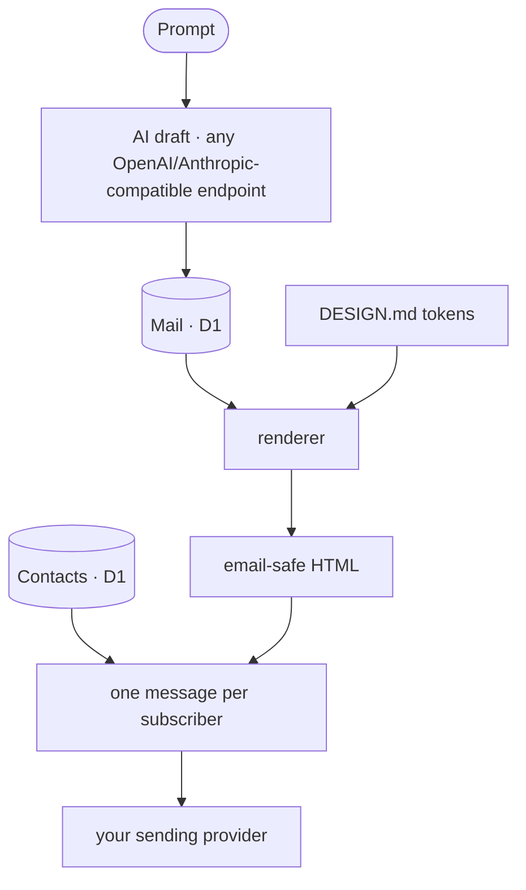

# OpenNewsletter — The Open-Source Mailchimp & beehiiv Alternative

[](https://app.clawnify.com/deploy?repo=clawnify/OpenNewsletter)

A **generation-first newsletter studio**. Describe a newsletter and let AI draft
it, design it live with [DESIGN.md](https://github.com/google-labs-code/design.md)
tokens, and send it to a subscriber list **you own**. Built with
**React + Tailwind CSS + Hono + D1**, deploys to Cloudflare Workers via
[Clawnify](https://clawnify.com).

A self-hostable, open-source alternative to **Mailchimp**, **beehiiv**,
**Substack**, and **ConvertKit** — the AI editor, the brand controls, and the
sending pipeline, fully yours. No per-subscriber pricing, no lock-in.

Your contacts live in **your own database**, not in a sending provider's
account. The provider is just delivery, and it's swappable.

## Features

- **Generation-first editor** — write a prompt, get a structured draft
  (eyebrow, title, deck, Markdown body); revise it in place.
- **Live DESIGN.md design panel** — a Basic/Advanced token editor (colors,
  typography, layout, sections) that re-renders the preview as you type.
  The same tokens drive the sent email.
- **Desktop / Mobile preview** — a faithful canvas that mirrors the email
  renderer exactly.
- **Template library** — three shipped looks (Classic Editorial, Minimal
  Mono, Bold Bulletin); **Save as…** turns any mail into your own template.
- **Your subscriber list, in your database** — audiences and contacts live in
  D1. Manage them from the Audience view; export them whenever you like.
- **Import subscribers from a CSV or your CRM** — the file is parsed in your
  browser and you approve the result row by row, including everything that will
  be skipped. Consent is a deliberate choice either way, never a side effect of
  a file existing.
- **Double opt-in** — signups land as `pending` and only become subscribers
  when the person confirms by email. Only confirmed contacts are ever sent to,
  so an import can't quietly start mailing people who never asked.
- **Embeddable signup widget** — drop `<script src=".../widget.js">` on your
  own site; it starts the same opt-in flow.
- **Sending** — send now, or send a test to yourself. Bring your own API key.
- **Email-safe rendering** — table-wrapped, inline-styled HTML with a
  per-subscriber unsubscribe footer, plus the `List-Unsubscribe` headers
  mailbox providers expect from bulk senders.

## How it works



One message per subscriber rather than a single broadcast, so each carries its
own unsubscribe link — a shared link would let whoever clicks it unsubscribe
everyone.

A **template** = a `DESIGN.md` token set + a content skeleton. Each mail can
override the template's tokens; the design panel edits that override live and
"Save as…" serializes it back to the DESIGN.md format.

## Tech Stack

| Layer | Technology |
|-------|-----------|
| **Frontend** | React, TypeScript, Tailwind CSS v4, Vite, shadcn/ui |
| **Backend** | Hono (Cloudflare Worker) |
| **Database** | D1 (mails, templates, settings, audiences, contacts) |
| **Email** | Bring your own provider — Resend wired today |
| **AI** | Any OpenAI- or Anthropic-compatible endpoint (configurable) |
| **Icons** | Lucide |

## Quickstart

```bash
git clone https://github.com/clawnify/OpenNewsletter.git
cd open-newsletter
pnpm install
pnpm dev          # Vite on :5173, Worker + local D1 on :8787
```

Open `http://localhost:5173`. The schema is applied to local D1 automatically.

### Local keys

To exercise sending and generation locally, copy the example env file:

```bash
cp .dev.vars.example .dev.vars
```

```
RESEND_API_KEY=re_xxxxxxxx        # https://resend.com/api-keys
AI_API_KEY=sk-xxxxxxxx            # any OpenAI-/Anthropic-compatible endpoint
AI_PROVIDER=openai                # or "anthropic"
AI_MODEL=gpt-4.1                  # e.g. claude-sonnet-4-5, llama3.1
# AI_BASE_URL=https://api.openai.com/v1   (default for AI_PROVIDER=openai)
```

Restart `pnpm dev` after editing `.dev.vars`.

### Sender setup

In **Settings**, set your publication name and a **from address on a domain
you've verified with your sending provider**. Sending is refused from an
unverified domain, and you'll be told which one and where to fix it.

Audiences and contacts are yours — create an audience in the **Audience** view;
no provider dashboard involved.

### Growing the list

Point people at the embeddable widget, or `POST /api/subscribe` from your own
form:

```html
<div data-newsletter-subscribe></div>
<script src="https://<your-app>/widget.js"></script>
```

Either way it's **double opt-in**: the contact is created `pending` and only
becomes a subscriber once they click the confirmation link. Sends go to
confirmed subscribers only.

Adding someone by hand from the Audience view also lands them `pending`. If
you're migrating a list that already has recorded consent, pass
`consent_evidence` to `POST /api/audiences/:id/contacts` to record how it was
obtained and mark them subscribed.

### Finding people

The Audience view shows one page of **50** at a time — newest first by default —
with the count above it (`1–50 of 812`). Three filters narrow the list, and all
three are applied by the database rather than in the browser, so a list of fifty
thousand behaves the same as a list of fifty:

- **Search** — type a term and press Enter. Matches email, first name, last name,
  the full name, and the name reversed, so `okonkwo amara` finds Amara Okonkwo.
  Case-insensitive; `%` and `_` are matched literally rather than as wildcards.
- **Added** — an inclusive `from`/`to` range on the date a contact was added.
- **Sort** — newest, oldest, or by name A–Z / Z–A.

Search applies on Enter (or the Search button), not on every keystroke; the date
and sort controls apply immediately. **Clear** resets all three.

`GET /api/audiences/:id/contacts?search=&from=&to=&sort=&page=&limit=` returns
`{ contacts, total, page, limit }`. `total` counts the *filtered* set, so it is
what the pager divides. `limit` defaults to 50 and is capped at 200 regardless of
what the request asks for. A `page` past the end is clamped to the last page
rather than answered with an empty list, and an unknown audience id is a 404
rather than an empty page — so "no such list" and "this list has nobody in it"
stay distinguishable.

Filtering and ordering are defined once, in `src/shared/contact-query.ts`, and
used by both the browser and the worker. That is deliberate: if the two built
their own queries, the count could describe a different set of rows than the
ones listed.

### Importing from a CSV

**Import CSV** in the Audience view reads a file from your machine. The parsing
happens in the browser: commas and newlines inside quoted names, `;`-separated
European exports, CRLF from Excel and a UTF-8 BOM are all handled, and the
delimiter is detected (with an override) rather than assumed. You then map
columns to first name / last name / email and see the result before anything is
saved — every row that will be imported, and every row that will not, with the
reason.

By default the rows land **`pending`**: on the list, mailed to nobody. Turn on
**Mark these people as subscribed** and give a sentence describing how they
agreed, and they are imported as subscribers instead — that sentence is stored
on every row as `consent_evidence` with `consent_source = 'import'`.

An import never touches someone it should not:

- **Unsubscribed** — never re-imported. A file is not a new consent, and
  re-adding someone who opted out is what turns a migration into spam
  complaints.
- **Already subscribed** — skipped, and their existing consent record is left
  alone rather than overwritten with a row from a spreadsheet.
- **Bounced** — skipped; the address is known bad.
- **Duplicate in the same file** — collapsed to the first occurrence, matched
  case- and whitespace-insensitively.

- `POST /api/audiences/:id/import-csv { rows, consent_evidence, mark_subscribed }` — up to 1000 rows; `consent_evidence` is required when `mark_subscribed` is true
- `POST /api/audiences/:id/contact-statuses { emails }` — who is already on the list, so the dialog can warn before the import rather than after

`demo/subscribers-sample.csv` is a ten-row file to try the importer with. It is
fictional and deliberately awkward: quoted commas, accented names, an
apostrophe, a `+` tag, mixed-case and a blank company cell, so the parts that
usually break a parser are in the file you first test with. Every address is on
`.example`, a reserved domain, so nothing in it can receive real mail.

### Importing from your CRM

When OpenNewsletter runs next to a CRM in the same Clawnify workspace, set
`CRM_APP_ID` to that app's id (a bundle install does this for you) and the
Audience view gains **Import from CRM**. It reads contacts live from the CRM,
lets you pick them, and asks how they agreed to hear from you before anyone is
imported. That sentence is stored on every row as `consent_evidence` with
`consent_source = 'crm_sync'`, and the CRM contact id is kept, so an
unsubscribe here leaves a note on that person's CRM timeline.

The CRM stays the system of record for the person. This app stays the system
of record for consent and membership. Nothing is mailed straight out of the
CRM, and people who unsubscribed here are never re-imported.

- `GET /api/crm/contacts?search=&page=&audience_id=` — the picker's read
- `POST /api/audiences/:id/import-crm { contact_ids, consent_evidence }` — up to 200 at a time; evidence is required

Without `CRM_APP_ID` neither route exists and the app behaves as a single
install.

## Deploy (Clawnify)

```bash
npx clawnify deploy
```

`clawnify.json` declares the env contract:

| Env | Required | Purpose |
|-----|----------|---------|
| `RESEND_API_KEY` | for sending | Your own key — delivery only; contacts stay in D1 |
| `AI_API_KEY` | for AI | The Generate button and the assistant |
| `AI_PROVIDER` | no | `openai` (default) or `anthropic` — the protocol your endpoint speaks |
| `AI_BASE_URL` | no | The endpoint; defaults per protocol |
| `AI_MODEL` | no | The model id (defaults per protocol) |
| `OPENROUTER_API_KEY` | no | Legacy alias for `AI_API_KEY`, still honoured |
| `NEWSLETTER_MODEL` | no | Legacy alias for `AI_MODEL`, still honoured |

On Clawnify these are injected automatically from your org's API keys /
environment variables at deploy time — no secrets in the app.

## Project layout

```
src/
  shared/
    design.ts        — DESIGN.md token model, panel metadata, CSS-var + serializer
    templates.ts     — built-in templates (runtime mirror of templates/*/DESIGN.md)
    markdown.ts      — email-safe Markdown → HTML
    csv.ts           — CSV parsing, column mapping and import rules (browser + server)
    consent.ts       — what counts as consent evidence, shared by every import path
    contact-query.ts — subscriber list search / date filters / ordering / paging
    types.ts         — Mail, Template, Settings, Contact types
  server/
    index.ts         — Hono API (mails, templates, settings, audiences,
                       subscribe/confirm/unsubscribe, widget, generate, send)
    contacts.ts      — audiences + contacts + the consent lifecycle
    crm.ts           — the sibling CRM's contacts, via the platform proxy
    render.ts        — mail + tokens → email-safe inlined HTML
    ai.ts            — generation (prompt → draft) over the configured endpoint
    llm.ts           — which endpoint/protocol/model, from the environment
    agent.ts         — the editor assistant (streaming, tool-calling)
    providers/       — EmailProvider interface (send-only) + adapters
    schema.sql       — D1 schema
  client/
    app.tsx          — shell + nav
    store.tsx        — app state
    components/
      editor.tsx       — top bar, preview/edit, generation bar
      preview.tsx      — live canvas (mirrors render.ts)
      design-panel.tsx — the DESIGN.md token editor
      csv-import-dialog.tsx  — local CSV import: map columns, review, consent
      crm-import-dialog.tsx  — the same, reading a sibling CRM
      …                — mails, templates, audience, settings views
DESIGN.md            — the default brand (Classic Editorial), Google Labs format
templates/<slug>/    — each template as DESIGN.md + content.md
```

## Roadmap

- **HTML-to-image components** — author rich illustrations, diagrams, and
  "component" graphics in HTML + CSS and render them to static images at send
  time, so custom visuals stay email-safe (email clients don't run JS or modern
  CSS). Makes branded illustrations and charts a drop-in block.
- **AI sources** — ground a draft in real data instead of just a prompt. Connect
  a source and the generator pulls from it. First up: **GitHub commits** →
  generate a "what we shipped this week" issue straight from your repo history.
  Planned: changelogs, product analytics, RSS/Atom, Linear/Jira.

## License

MIT
