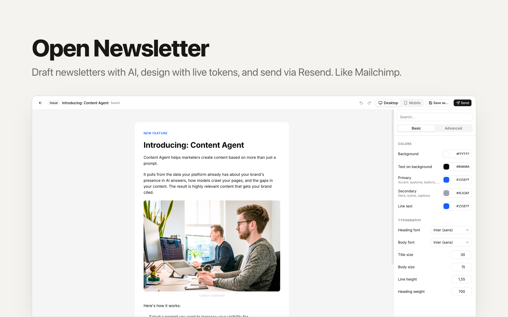
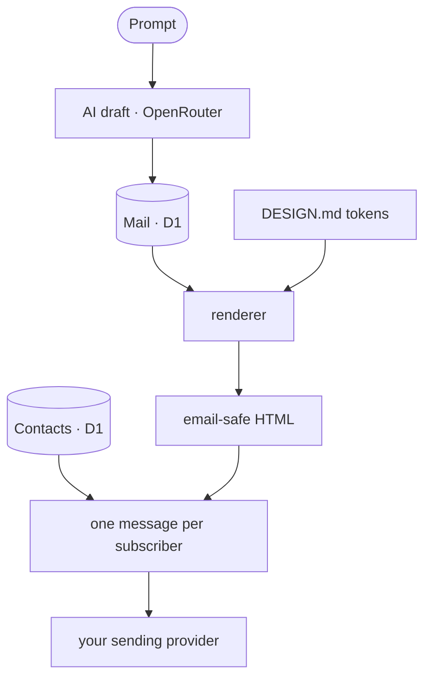

# OpenNewsletter — The Open-Source Mailchimp & beehiiv Alternative

[](https://app.clawnify.com/deploy?repo=clawnify/OpenNewsletter)

A **generation-first newsletter studio**. Describe a newsletter and let AI draft
it, design it live with [DESIGN.md](https://github.com/google-labs-code/design.md)
tokens, and send it to a subscriber list **you own**. Built with
**React + Tailwind CSS + Hono + D1**, deploys to Cloudflare Workers via
[Clawnify](https://clawnify.com).

A self-hostable, open-source alternative to **Mailchimp**, **beehiiv**,
**Substack**, and **ConvertKit** — the AI editor, the brand controls, and the
sending pipeline, fully yours. No per-subscriber pricing, no lock-in.

Your contacts live in **your own database**, not in a sending provider's
account. The provider is just delivery, and it's swappable.

## Features

- **Generation-first editor** — write a prompt, get a structured draft
  (eyebrow, title, deck, Markdown body); revise it in place.
- **Live DESIGN.md design panel** — a Basic/Advanced token editor (colors,
  typography, layout, sections) that re-renders the preview as you type.
  The same tokens drive the sent email.
- **Desktop / Mobile preview** — a faithful canvas that mirrors the email
  renderer exactly.
- **Template library** — three shipped looks (Classic Editorial, Minimal
  Mono, Bold Bulletin); **Save as…** turns any mail into your own template.
- **Your subscriber list, in your database** — audiences and contacts live in
  D1. Manage them from the Audience view; export them whenever you like.
- **Double opt-in** — signups land as `pending` and only become subscribers
  when the person confirms by email. Only confirmed contacts are ever sent to,
  so an import can't quietly start mailing people who never asked.
- **Embeddable signup widget** — drop `<script src=".../widget.js">` on your
  own site; it starts the same opt-in flow.
- **Sending** — send now, or send a test to yourself. Bring your own API key.
- **Personalization** — write `Hi {{first_name|there}},` in any text. Each
  reader gets their own name, and the word after the bar goes to readers
  without one. `{{last_name}}` and `{{email}}` work the same way. Names are
  always inserted as plain text, so a signup can't slip a link into your issue.
- **Preview text** — set the line inboxes show after the subject, instead of
  letting them borrow the first words of the body.
- **Styling without code** — give any block a coloured section with its own
  padding (a dark hero, a light callout band); text inside switches to a
  readable colour on its own. Size and align images, and make a button
  outline or full width. The assistant can do all of it too.
- **HTML when blocks aren't enough** — add an HTML block for a design the
  blocks can't express (a hero with a background, a coloured band, buttons in
  columns), or choose **Edit as HTML** on any block to start from exactly the
  email markup it sends today. You edit it with a live preview; the assistant
  can write HTML blocks too. Merge tags work inside them. Scripts, forms and
  embeds are removed, and a snippet left unclosed can't spill into the next
  block.
- **Delivery tracking** — one click in Settings registers a Resend webhook with
  your own key. Hard bounces and spam complaints then stop future sends to
  that address on every list, and each sent issue shows delivered, clicked,
  opened and bounced. Clicks are shown first: Apple Mail opens every message
  on arrival, so opens run high.
- **Email-safe rendering** — table-wrapped, inline-styled HTML with a
  per-subscriber unsubscribe footer, plus the `List-Unsubscribe` headers
  mailbox providers expect from bulk senders.

## How it works



One message per subscriber rather than a single broadcast, so each carries its
own unsubscribe link — a shared link would let whoever clicks it unsubscribe
everyone.

A send is recorded per recipient. When it starts, the issue is frozen and a
delivery row is written for each confirmed subscriber; batches of 100 then go
out through the provider's batch API. An attempt whose outcome is unknown is
retried under the same idempotency key, so a timeout never mails a batch twice.
Closing the tab or a worker restart doesn't lose the send: on Clawnify a queued
job picks it up within a minute, and pressing Send again resumes it. If the
provider refuses the send outright (an unverified domain, a revoked key), it
stops as **failed** with the reason, and sending again after the fix delivers
only to the people who haven't had it.

A **template** = a `DESIGN.md` token set + a content skeleton. Each mail can
override the template's tokens; the design panel edits that override live and
"Save as…" serializes it back to the DESIGN.md format.

## Tech Stack

| Layer | Technology |
|-------|-----------|
| **Frontend** | React, TypeScript, Tailwind CSS v4, Vite, shadcn/ui |
| **Backend** | Hono (Cloudflare Worker) |
| **Database** | D1 (mails, templates, settings, audiences, contacts) |
| **Email** | Bring your own provider — Resend wired today |
| **AI** | OpenRouter (configurable model) |
| **Icons** | Lucide |

## Quickstart

```bash
git clone https://github.com/clawnify/OpenNewsletter.git
cd open-newsletter
pnpm install
pnpm dev          # Vite on :5173, Worker + local D1 on :8787
```

Open `http://localhost:5173`. The schema is applied to local D1 automatically.

### Local keys

To exercise sending and generation locally, copy the example env file:

```bash
cp .dev.vars.example .dev.vars
```

```
RESEND_API_KEY=re_xxxxxxxx        # https://resend.com/api-keys
OPENROUTER_API_KEY=sk-or-xxxxxxxx # https://openrouter.ai/keys
# NEWSLETTER_MODEL=anthropic/claude-sonnet-4   (optional override)
```

Restart `pnpm dev` after editing `.dev.vars`.

### Sender setup

In **Settings**, set your publication name and a **from address on a domain
you've verified with your sending provider**. Sending is refused from an
unverified domain, and you'll be told which one and where to fix it.

Audiences and contacts are yours — create an audience in the **Audience** view;
no provider dashboard involved.

### Growing the list

Point people at the embeddable widget, or `POST /api/subscribe` from your own
form:

```html
<div data-newsletter-subscribe></div>
<script src="https://<your-app>/widget.js"></script>
```

Either way it's **double opt-in**: the contact is created `pending` and only
becomes a subscriber once they confirm. Sends go to confirmed subscribers only.

- **Confirming takes a click.** The link opens a page with a Confirm button;
  loading the link alone changes nothing, so mail security scanners that open
  every link can't subscribe anyone.
- **Links expire** 7 days after their email. Signing up again inside 10
  minutes reuses the email already sent, so a form can't be used to flood
  someone's inbox.
- **Bots:** the widget carries a hidden honeypot field, and one network can
  start 10 signups an hour (the IP is stored hashed, for that hour only).
- **Nobody waits unseen.** The Audience view shows who never got a
  confirmation email (added by hand, or the email failed) and who hasn't
  confirmed a day later, with one button that emails them: the first
  confirmation, or a reminder, at most three emails per person.

Adding someone by hand from the Audience view also lands them `pending`,
until they confirm from the email that button sends. If
you're migrating a list that already has recorded consent, pass
`consent_evidence` to `POST /api/audiences/:id/contacts` to record how it was
obtained and mark them subscribed.

### Importing from your CRM

When OpenNewsletter runs next to a CRM in the same Clawnify workspace, set
`CRM_APP_ID` to that app's id (a bundle install does this for you) and the
Audience view gains **Import from CRM**. It reads contacts live from the CRM,
lets you pick them, and asks how they agreed to hear from you before anyone is
imported. That sentence is stored on every row as `consent_evidence` with
`consent_source = 'crm_sync'`, and the CRM contact id is kept, so an
unsubscribe here leaves a note on that person's CRM timeline.

The CRM stays the system of record for the person. This app stays the system
of record for consent and membership. Nothing is mailed straight out of the
CRM, and people who unsubscribed here are never re-imported.

- `GET /api/crm/contacts?search=&page=&audience_id=` — the picker's read
- `POST /api/audiences/:id/import-crm { contact_ids, consent_evidence }` — up to 200 at a time; evidence is required

Without `CRM_APP_ID` neither route exists and the app behaves as a single
install.

## Deploy (Clawnify)

```bash
npx clawnify deploy
```

`clawnify.json` declares the env contract:

| Env | Required | Purpose |
|-----|----------|---------|
| `RESEND_API_KEY` | for sending | Your own key — delivery only; contacts stay in D1 |
| `OPENROUTER_API_KEY` | for AI | The Generate button |
| `NEWSLETTER_MODEL` | no | Override the generation model |
| `RESEND_WEBHOOK_SECRET` | no | Signing secret of a Resend webhook you created by hand. Only needed when your key can send but not manage webhooks; otherwise Settings → Delivery tracking → Turn on sets it up |

On Clawnify these are injected automatically from your org's API keys /
environment variables at deploy time — no secrets in the app.

## Project layout

```
src/
  shared/
    design.ts        — DESIGN.md token model, panel metadata, CSS-var + serializer
    templates.ts     — built-in templates (runtime mirror of templates/*/DESIGN.md)
    markdown.ts      — email-safe Markdown → HTML
    types.ts         — Mail, Template, Settings, Contact types
  server/
    index.ts         — Hono API (mails, templates, settings, audiences,
                       subscribe/confirm/unsubscribe, widget, generate, send)
    contacts.ts      — audiences + contacts + the consent lifecycle
    sending.ts       — the send engine: per-recipient deliveries, batches, resume
    events.ts        — what bounces, complaints, opens and clicks change
    render.ts        — mail + tokens → email-safe inlined HTML
    ai.ts            — OpenRouter generation
    providers/       — EmailProvider interface (send-only) + adapters
    schema.sql       — D1 schema
  client/
    app.tsx          — shell + nav
    store.tsx        — app state
    components/
      editor.tsx       — top bar, preview/edit, generation bar
      preview.tsx      — live canvas (mirrors render.ts)
      design-panel.tsx — the DESIGN.md token editor
      …                — mails, templates, audience, settings views
DESIGN.md            — the default brand (Classic Editorial), Google Labs format
templates/<slug>/    — each template as DESIGN.md + content.md
```

## Roadmap

- **HTML-to-image components** — author rich illustrations, diagrams, and
  "component" graphics in HTML + CSS and render them to static images at send
  time, so custom visuals stay email-safe (email clients don't run JS or modern
  CSS). Makes branded illustrations and charts a drop-in block.
- **AI sources** — ground a draft in real data instead of just a prompt. Connect
  a source and the generator pulls from it. First up: **GitHub commits** →
  generate a "what we shipped this week" issue straight from your repo history.
  Planned: changelogs, product analytics, RSS/Atom, Linear/Jira.

## License

MIT
